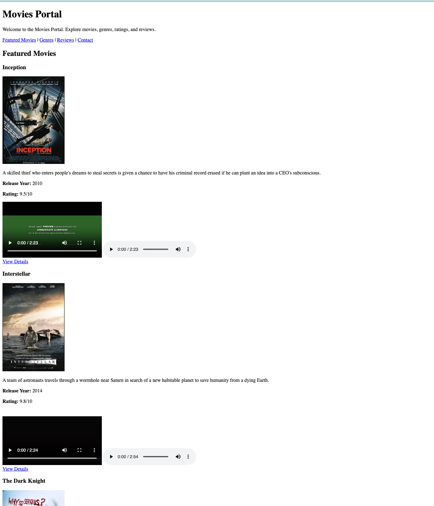

# CPSC-349 Lab 1: My Favorite Movies Portal

## Overview

### What is HTML?

**HTML (HyperText Markup Language)** is the standard language used to create and structure pages on the World Wide Web. Rather than a programming language, it is a **markup language** that uses special annotations called **tags** (such as `<h1>`, `
`, `<a>`) to define and organize elements so that web browsers know how to display text, images, forms, and interactive features to the user.

### The Evolution to HTML5

Since its creation in 1989, HTML has evolved through several iterations to meet the demands of the modern internet:

- **HTML 1.0 to 4.01 (1991–1999)**: The early web consisted of simple text and document styling. Layouts were often built using heavily nested `<table>` tags or generic `
` tags, which lacked any contextual meaning for search engines or screen readers.
- **XHTML**: An attempt to make HTML comply with stricter XML coding rules. It was highly rigid, and a single syntax error could break an entire webpage.
- **HTML5 (Released in 2014)**: The modern standard we use today. HTML5 revolutionized web design by introducing native multimedia elements (like `<video>` and `<audio>`), advanced APIs, and **Semantic Elements** (like `<header>`, `<nav>`, `<main>`, and `<article>`). Instead of generic wrappers, HTML5 elements explicitly describe their content's meaning, dramatically improving accessibility, standardizing layouts, and boosting SEO.

In this introductory lab, you will explore these modern semantic HTML5 elements. Instead of building generic layouts with unstyled generic containers, you will build a structured, semantic, and accessible web page designed to catalog and review movie titles.

Semantic HTML5 elements improve code readability, search engine optimization (SEO), and web accessibility for assistive technologies like screen readers. In this lab, we use:

- **`<header>`**: Groups introductory content, branding, and major titles at the top of a page or section.
- **`<nav>`**: Defines a block of navigation links designed for site-wide or page-specific menus.
- **`<main>`**: Encloses the unique, central content of the document that is not repeated across other pages.
- **`<section>`**: Groups related content together into distinct thematic regions of a page.
- **`<article>`**: Defines a self-contained, independent composition like a card, post, or article.
- **`<table>`**: Formats structured tabular data into organized rows, header blocks, and data cells.
- **`<form>`**: Wraps interactive controls like inputs, select boxes, and textareas to capture and submit user input.
- **`<video>`**: Native HTML5 element used to embed video files (such as movie trailers) directly with built-in playback controls.
- **`<audio>`**: Native HTML5 element used to embed audio files (such as soundtrack themes) directly with built-in playback controls.

For a full list of all available HTML5 tags and elements, you can refer to the official [MDN HTML Elements Reference](https://developer.mozilla.org/en-US/docs/Web/HTML/Element) or the beginner-friendly [W3Schools HTML Tag Reference](https://www.w3schools.com/tags/default.asp).

Your objective is to personalize the provided Movies Portal template to showcase **your own favorite movies**, changing the page's current content to reflect your unique preferences.

---

## Getting Started

To view and preview your web portal:

1. Open your project folder in your computer's file explorer.
2. Double-click the `index.html` file to open and render it directly in your web browser.
3. Every time you make changes to your code, simply save the file and refresh your browser page (`F5` or `Ctrl+R` / `Cmd+R`) to view the updates live!

---

Here is how it should render on your browser:

## 

## Tasks

To complete this lab, you must personalize the template with your own favorite movies:

- **Personalize 3 Movies**: Replace the default movie titles, summary paragraphs, and release years with your favorite choices (exactly 3 total).
- **Add Multimedia Integration**: Include a native HTML5 **`<video>`** tag (for a trailer) and a native HTML5 **`<audio>`** tag (for a theme song) inside each of the 3 movie `<article>` cards.
- **Add Custom Ratings**: Give a personal rating (e.g., `9.2/10`) for each movie card.
- **Replace Images**: Download poster images for your 3 chosen movies, save them in your workspace, and link them using accessible `alt` text.
- **Update Genres**: Modify the unordered list of genres to match your movie choices.
- **Update Top Movies Table**: Update the table to list your 3 chosen movies correctly with matching columns.

---

## Instructions

Follow these simplified steps to customize your portal:

1. **Set Up Asset Folders**: Inside your project directory, create separate folders to organize your assets: `images/` (for posters), `videos/` (for trailers), and `audios/` (for theme songs).
2. **Download Movie Assets**: Source high-quality images, short trailer clips, and audio tracks for your chosen movies. _(See the **Recommended Resources** section below for where to find these)._
3. **Customize Code**: Edit `index.html` to update the 3 movie `<article>` cards, insert the `<video controls>` and `<audio controls>` tags pointing to your local asset folders, update the genre list, and configure the top movies table.
4. **Verify Elements**: Ensure all semantic tags (`<header>`, `<nav>`, `<main>`, `<section>`, `<article>`, `<table>`, `<form>`, `<video>`, and `<audio>`) are kept fully intact and function correctly.

### Recommended Resources for Assets

If you need assets, you can download them from these free resources:

- **Posters**: Find and download posters from [TMDB](https://www.themoviedb.org/), [IMDb](https://www.imdb.com/), or [Wikimedia Commons](https://commons.wikimedia.org/).
- **Trailers (Videos)**: Download free `.mp4` video clips from [Archive.org](https://archive.org/details/movies), [Pexels Video](https://www.pexels.com/videos/), [Pixabay Video](https://pixabay.com/), or via online YouTube downloaders.
- **Themes (Audio)**: Download royalty-free `.mp3` tracks from [Pixabay Music](https://pixabay.com/music/) or the [Free Music Archive](https://freemusicarchive.org/).

---

## Submission Requirements

Students must submit:

- **GitHub Repository**: Link to a public repository containing your customized codebase, complete with your asset subdirectories (`images/`, `videos/`, and `audios/`).
- **Verification & Accuracy**: Confirm that all poster images, local videos, and local audio files load successfully in the browser, and that the top movies table matches your article cards exactly.
- **Updated README**: Replace the placeholder screenshot link (`screenshot_1.png`) with an actual screenshot of your running portal.

---
